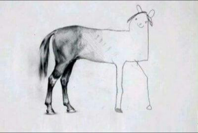

title: 8 - Extra
class: animation-fade
layout: true

.bottom-bar[

{{title}}

]

---

class: impact

# {{title}}

## ¿Errores? Futuro sólido

> "Si la depuración es el proceso de eliminar errores, entonces la programación debe ser el proceso de ponerlos".
>
> -- **E. W. Dijkstra**.

---

### Código excepcionalmente robusto

#### En desarrollo

- **Detección** temprana de errores con herramientas y tests.
- Diferenciar entre lo improbable, lo excepcional y lo **incorrecto**.

--

#### En ejecución

- Recuperar mucha información técnica para el **diagnóstico**.
- Pero informar al **usuario** en el tono adecuado.
- Dar una pista para la siguiente **acción**.

---

> "Hay dos maneras de escribir programas sin fallos; sólo funciona la tercera.".
>
> -- **Alan Perlis**.

> "El código huele.".
>
> -- **Martin Fowler**.

---

[Limpiar es refactorizar: en resumen... ](https://twitter.com/LlewellynFalco/status/633363986273189888)

---

---

> "Es mucho más fácil hablar de código que escribir código".
>
> -- **John O'Nolan**.

---

---

> “Las prisas pasan, la mierda queda.”
>
> -- **Programador anónimo**

---

---

> "Duplication is the primary enemy of a well-designed system"

> ;-)

> ;-)
>
> -- **Robert C. Martin**

- [Siguiente ->](./9-artisan.html)

- [<- Vuelta al índice ](./)

